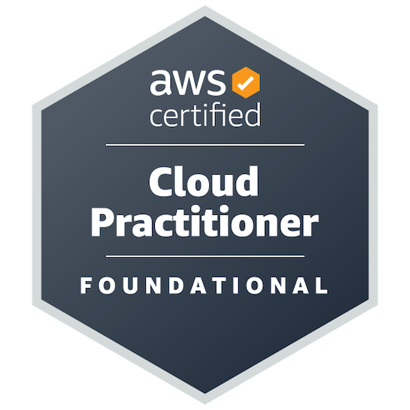
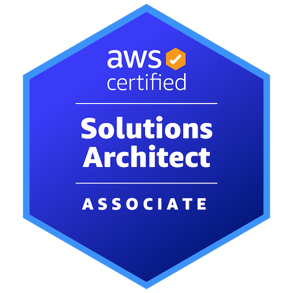
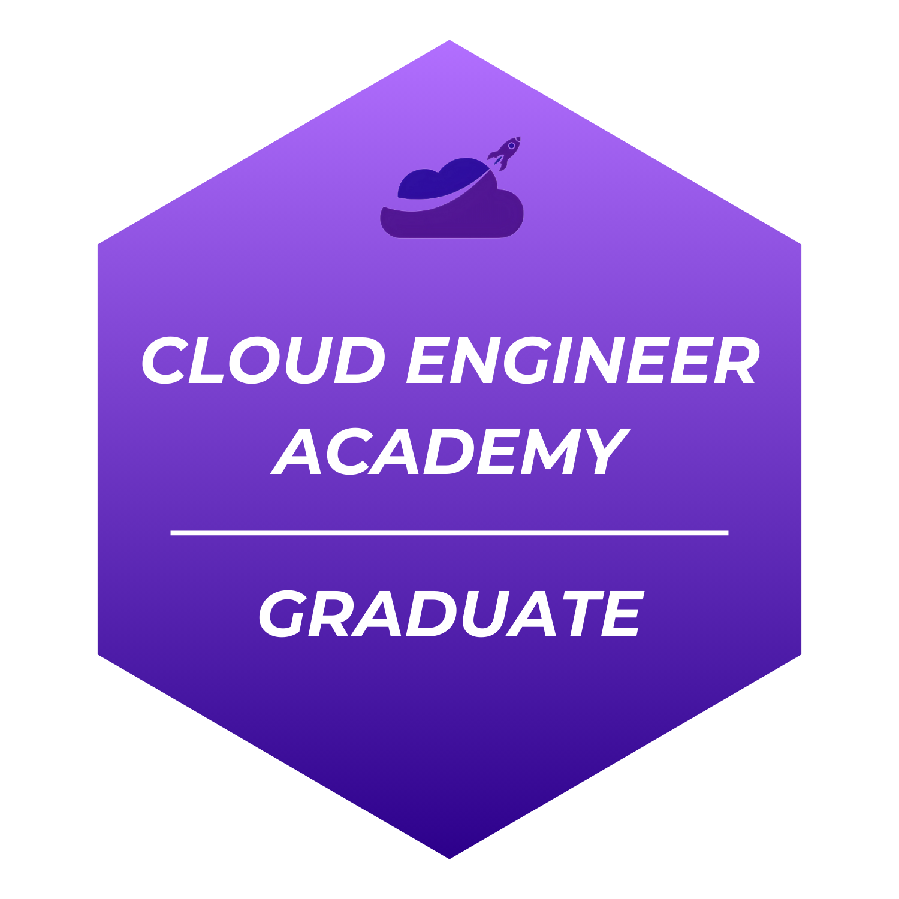

# Stiaan Terblanche

🏪 Retail Business Owner turned Cloud Engineer | 2x AWS Certified Professional

## About Me

I spent 7 years running my own retail business before making the leap into cloud computing. That experience taught me how to solve real problems for real people under real constraints - budget, time, things breaking at the worst moment - and I bring that same practical, ownership mindset to how I design and build cloud infrastructure. I'm currently deep in hands-on AWS and Infrastructure-as-Code work, building out a portfolio of projects that mirror real consulting engagements rather than isolated tutorials.

## 🛠️ Technical Expertise

- **Cloud Platforms:** AWS (EC2, S3, IAM, VPC, Lambda, and Serverless architectures)
- **Infrastructure as Code:** Terraform, AWS CDK, and CloudFormation
- **Cloud Migration:** modernising legacy infrastructure into scalable, AWS-based solutions
- **DevOps & Automation:** CI/CD pipelines, GitHub Actions, and deployment automation
- **Cloud Security:** IAM policy design, MFA hardening, least-privilege access, network security, and security best practices
- **Containers:** Docker, ECS, and Fargate
- **AI in the Cloud:** exploring practical AI/ML integration on AWS

## 🏆 Certifications

- [AWS Certified Cloud Practitioner](https://www.credly.com/badges/683a7039-9c43-4a23-abcb-07c405b9cd72/public_url)
- [AWS Certified Solutions Architect – Associate](https://www.credly.com/badges/4f450030-f867-47d5-b328-cf65bc7a37fd/public_url)
- [Cloud Engineering Academy Graduate](https://cloudengineeracademy.io/)

## 🏅 Badges & Achievements

  
  
  

## 🤝 Open to Collaborate On

- Cloud infrastructure & IaC projects
- Cloud security and IAM design
- DevOps automation
- Ethical AI/ML on cloud platforms

⚡ **Fun fact:** Running a retail business for 6 years means I've already spent years thinking about uptime, customer trust, and what happens when a "small" failure cascades — turns out that's basically the job description for cloud architecture too.

## Completed Projects

### 🔐 StartupCo — Cloud Security & IAM Hardening
A portfolio consulting case study for a fictional fitness-tracking startup that launched fast and left security behind - 10 employees sharing root credentials, no MFA, no least-privilege access, no separation between dev and prod. This project takes that environment from "click-and-pray" to a governed, auditable baseline: role-based IAM groups (Developers, Operations, Finance, Data Analysts), enforced MFA policy, and a GuardDuty detection layer designed into the target-state architecture. The console-built environment was then codified into Terraform using declarative `terraform import`, verified against a clean `terraform plan` - proving the code matches the live account, not just the intended design. Documented with a clear scale-up path to a multi-account AWS Organizations model with centralized identity, policy-as-code guardrails, and CI-validated Terraform.

### 🌐 Portfolio Site Deployment — Next.js on AWS via Terraform
A freelance client project: deploying a Next.js static portfolio site on AWS with full Infrastructure as Code ownership. The architecture serves the site through CloudFront backed by a private S3 bucket, locked down with Origin Access Control - the current AWS-recommended approach, replacing the legacy OAI method. Terraform manages the entire stack end-to-end, including S3 native state locking rather than the older DynamoDB-based approach, so the project reflects present-day best practice rather than a copy-pasted tutorial pattern.

## Links & Social Media

| Service  | URL |
|----------|-----|
| GitHub   | https://github.com/PeaceMaker122 |
| Medium   | https://medium.com/@PeaceMaker122 |
| LinkedIn | https://www.linkedin.com/in/stiaan-terblanche |

## How to Reach Me

📫 stiaant1@gmail.com