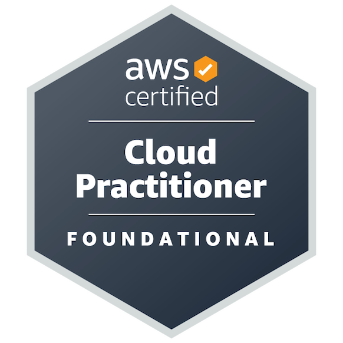
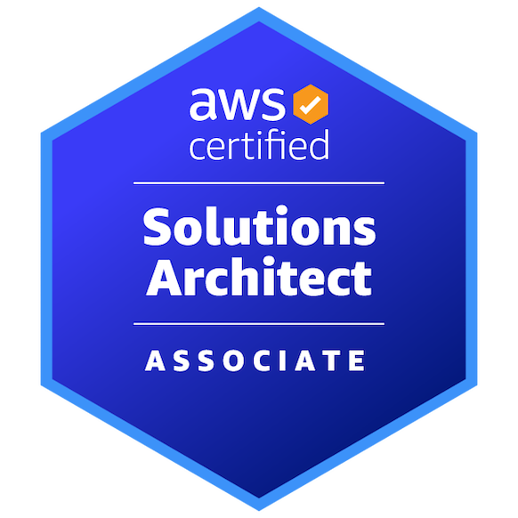
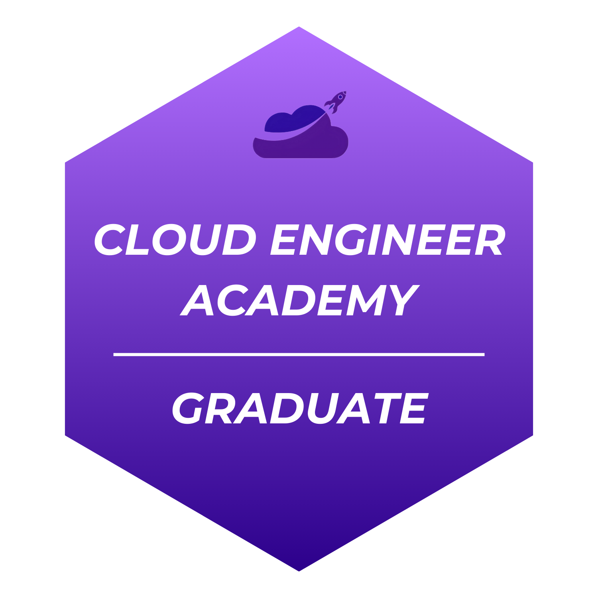

# Stiaan Terblanche

🏪 Retail Business Owner turned Cloud Engineer | 2x AWS Certified Professional

## About Me

I spent 7 years running a retail business and a nationwide e-commerce operation before moving into cloud. It taught me to solve real problems under real constraints: budget, time, and things breaking at the worst moment. I bring that same ownership mindset to cloud, with a focus on security and AI: infrastructure that is secure by design, cost-aware, and tested by breaking it on purpose, and AI that supports human decisions instead of replacing them.

My portfolio mirrors real consulting engagements, not isolated tutorials. Every project comes with architecture diagrams, a decisions log, and evidence.

## 🛠️ Technical Expertise

- **Cloud Security:**      
- **AI in the Cloud:**    
- **Infrastructure as Code:**    
- **DevOps & Automation:**    
- **Containers:**    
- **Observability:**     
- **Cloud Platforms:**          
- **Cloud Migration:**   

## 🏆 Certifications

- [AWS Certified Cloud Practitioner](https://www.credly.com/badges/683a7039-9c43-4a23-abcb-07c405b9cd72/public_url)
- [AWS Certified Solutions Architect – Associate](https://www.credly.com/badges/4f450030-f867-47d5-b328-cf65bc7a37fd/public_url)
- [Cloud Engineering Academy Graduate](https://cloudengineeracademy.io/)

## 🏅 Badges & Achievements

  
  
  

## 🤝 Open to Collaborate On

- Cloud infrastructure & IaC projects
- Cloud security and IAM design
- DevOps automation
- Ethical AI/ML on cloud platforms

⚡ **Fun fact:** Running a retail business for 7 years means I've already spent years thinking about uptime, customer trust, and what happens when a "small" failure cascades - turns out that's basically the job description for cloud architecture too.

## Completed Projects

### 🛒 [ShopMesh: Containerized Microservices Platform](https://github.com/PeaceMaker122/05-ShopMesh-Containerized-Microservices)
A containerized microservices platform that decomposes a coupled product catalog and shopping cart application into independently deployable and scalable Node.js services. Docker Compose supports local multi-container development, while AWS CDK provisions the production platform on ECS Fargate with private service-to-service communication through ECS Service Connect. Catalog owns product data in Aurora Serverless v2 PostgreSQL, Cart owns cart data in DynamoDB, and Secrets Manager handles database credentials without hardcoding them.

The platform uses a single HTTPS Application Load Balancer with path-based routing, private subnets for ECS tasks and databases, and ECR image scanning. GitHub Actions provides CI/CD with short-lived OIDC credentials, building and pushing only the affected service image through separate staging and production workflows. CloudWatch logs, Container Insights, alarms, EventBridge, a Lambda triage function, Amazon Bedrock, and SNS provide human-reviewed operational feedback. Failure testing deliberately triggered an unhealthy deployment and an application alarm, proving both ECS circuit-breaker rollback and the alarm-to-AI-triage notification path.

### ⚙️ [CloudPipe: CI/CD Pipeline Automation](https://github.com/PeaceMaker122/04-CloudPipe-Automation)
A DevOps consulting case study for a small web development company whose developers deployed changes by manually uploading files to production - slow, error-prone, and stressful. This project replaces that workflow with a fully automated CI/CD pipeline: code pushed to GitHub is automatically reviewed, deployed to a private staging environment, and promoted to production only on merge to `main`, with the merge acting as the promotion gate.

All infrastructure is defined as code with AWS CDK. GitHub Actions authenticates to AWS via OIDC instead of long-lived access keys, with three tightly scoped IAM roles using exact-match trust conditions so feature branches can only reach staging and only merges to `main` can reach production. The delivery layer serves the live site through CloudFront backed by fully private S3 buckets with OAC, HTTPS via ACM, and a real domain through Route 53. Each pull request is also scanned by an AI reviewer powered by Amazon Bedrock, which flags risky changes as a non-blocking comment for the human reviewer - and during the build it caught a real authentication-breaking issue.

Rollback and monitoring were both tested end to end, not just documented: a deliberately broken deployment was restored using S3 object versioning plus a CloudFront cache invalidation, and a Lambda synthetic check with a CloudWatch alarm and SNS notification alerted the team when the live site failed. The production site was `stiaan.click`.

### 🖥️ [Cloud Engineering Portfolio Website](https://github.com/PeaceMaker122/03-Portfolio-Website-Public)
A responsive Next.js and React portfolio built to present my cloud engineering experience through technical evidence rather than a conventional résumé alone. The site uses the App Router, structured TypeScript data, and a focused architecture-led design to bring together my professional background, capabilities, certifications, project work, contact details, and direct repository links. It is deployed through a GitHub-connected Vercel workflow, with content and presentation separated so profile information can be updated consistently.

The website also includes a server-side AI Architecture Guide powered by the Vercel AI SDK and AI Gateway. It loads the documented project knowledge base from Markdown files and provides grounded answers about architecture decisions, security controls, trade-offs, and implementation choices without exposing credentials or inventing unsupported claims. An anonymous contact form adds server-side validation, honeypot bot protection, and a Resend delivery path, demonstrating practical attention to secure defaults, operational boundaries, and maintainable cloud application design.

### 🏥 [TechHealth Inc.: AWS Infrastructure Migration](https://github.com/PeaceMaker122/02-TechHealth-Inc-AWS-Migration)
A healthcare infrastructure migration case study focused on moving a manually managed AWS patient-portal environment toward an auditable, repeatable platform with AWS CDK and TypeScript. The target design uses a two-Availability-Zone VPC, layered web/app/data architecture, Auto Scaling Groups, a Multi-AZ MySQL RDS database in private subnets, Secrets Manager, least-privilege security groups, and Systems Manager Session Manager instead of SSH.

As a consultant-led enhancement, I also built an AWS-native AI security review pipeline: synthesized CloudFormation templates are uploaded to S3, EventBridge triggers a Lambda reviewer, Amazon Bedrock evaluates RDS exposure, SSH access, IAM permissions, and network segmentation, and the findings are stored in S3 with CloudWatch execution logs for an auditable trail. The end-to-end pipeline was deployed and tested successfully, and the review surfaced genuine risks in the demonstration environment - including public web-tier placement and a shared EC2 IAM role - showing how automated review can support, rather than replace, human engineering judgment.

### 🔐 [StartupCo: Cloud Security & IAM Hardening](https://github.com/PeaceMaker122/01-StartupCo-Security-Project)
A portfolio consulting case study for a fictional fitness-tracking startup that launched fast and left security behind - 10 employees sharing root credentials, no MFA, no least-privilege access, no separation between dev and prod. This project takes that environment from "click-and-pray" to a governed, auditable baseline: role-based IAM groups (Developers, Operations, Finance, Data Analysts), enforced MFA policy, and a GuardDuty detection layer designed into the target-state architecture.

The console-built environment was then codified into Terraform using declarative `terraform import`, verified against a clean `terraform plan` - proving the code matches the live account, not just the intended design. Documented with a clear scale-up path to a multi-account AWS Organizations model with centralized identity, policy-as-code guardrails, and CI-validated Terraform.

### 🌐 [Portfolio Site Deployment: Next.js on AWS via Terraform](https://github.com/PeaceMaker122/00-Terraform-Portfolio-Project)
A freelance client project: deploying a Next.js static portfolio site on AWS with full Infrastructure as Code ownership. The architecture serves the site through CloudFront backed by a private S3 bucket, locked down with Origin Access Control - the current AWS-recommended approach, replacing the legacy OAI method. Terraform manages the entire stack end-to-end, including S3 native state locking rather than the older DynamoDB-based approach, so the project reflects present-day best practice rather than a copy-pasted tutorial pattern.

## Links & Social Media

| Service  | URL |
|----------|-----|
| Website  | https://www.stiaan.dev |
| GitHub   | https://github.com/PeaceMaker122 |
| Medium   | https://medium.com/@PeaceMaker122 |
| LinkedIn | https://www.linkedin.com/in/stiaan-terblanche |

## How to Reach Me

📫 stiaant1@gmail.com
